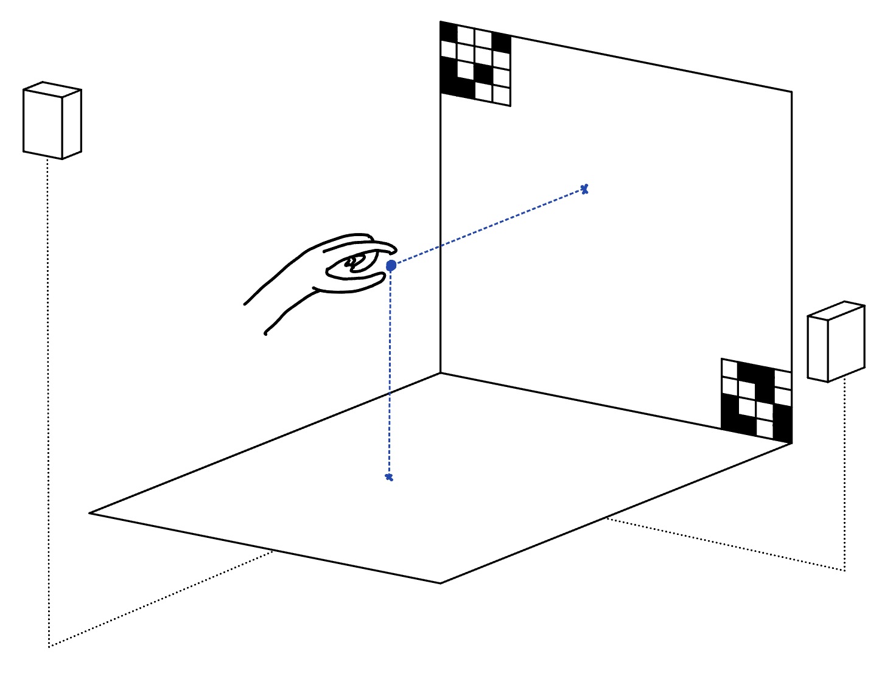

# cv_hand_controller

This ROS 2 package allows for the control of a robotic end-effector by tracking the operator's hand in the real world.



## Prerequisites

- Two V4L2 compatible cameras
    - Tested with innomaker WS-1080p (YUYV 640x480 30fps)
- ROS 2 workspace
    - Tested with [ROS 2 Humble](https://docs.ros.org/en/humble/index.html)
- python >= 3.10
    - mediapipe >= 0.10.14
    - opencv-contrib-python >= 4.12

```sh
pip install "numpy~=2.2.0" mediapipe opencv-contrib-python
```

## Installation
Navigate to your ROS 2 workspace and clone this repo:
```sh
cd ~/ros2_ws/src
git clone https://github.com/owenpark8/cv_hand_controller.git
```

Build the `cv_hand_controller` package:
```sh
cd ~/ros2_ws
colcon build --symlink-install --packages-select cv_hand_controller
```

## Camera calibration

For proper triangulation, we must calibrate both of our cameras in two steps:
1. Intrinsic calibration using a ChArUco board
2. Full stereo calibration using intrinsics and an ArUco tag in shared frame

### Intrinsic calibration
You may obtain a ChArUco board with the provided `intrinsic_calibration.py` script:
```sh
# using default board parameters
python3 scripts/intrinsic_calibration.py --print-board
```

Intrinsic calibration must be run twice: once for each camera:
```sh
python3 scripts/intrinsic_calibration.py --camera-index 0 --output-json side_camera_intrinsics.json
python3 scripts/intrinsic_calibration.py --camera-index 2 --output-json top_camera_intrinsics.json
```

Please see the help for all arguments:
```sh
python3 scripts/intrinsic_calibration.py --help
```

The rest of the steps will assume you have saved the side view camera intrinsics in `side_camera_intrinsics.json` and the top view camera intrinsics in `top_camera_intrinsics.json`.

### Full stereo calibration

Stereo calibration requires an ArUco tag that will act as the origin when running triangulation.

You may obtain an ArUco tag with the provided `stereo_calibration.py` script:
```sh
# using default tag parameters
python3 scripts/stereo_calibration.py --print-tag
```

Now, with both cameras in their desired positions for the final operator setup and the ArUco tag rigidly fixed to the desired coordinate frame origin (must be in view of both cameras), you may run the stereo calibration script:
```sh
# modify --tag-size-m to match the size of your ArUco tag
python3 scripts/stereo_calibration.py --tag-size-m 0.1 --cam0-json side_camera_intrinsics.json --cam0-index 0 --cam1-json top_camera_intrinsics.json --cam1-index 2
```

Please see the help for all arguments:
```sh
python3 scripts/stereo_calibration.py --help
```

## Running the ROS 2 nodes

```sh
source ~/ros2_ws/src/cv_hand_controller/environment.zsh
ros2 launch cv_hand_controller cv_hand_controller.launch.py
```